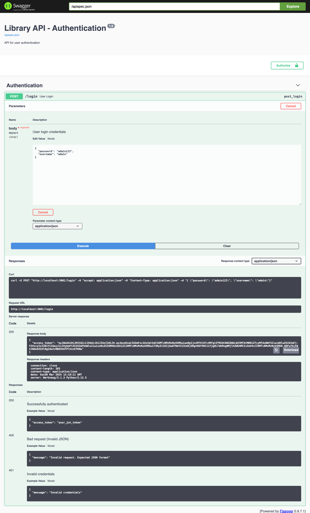
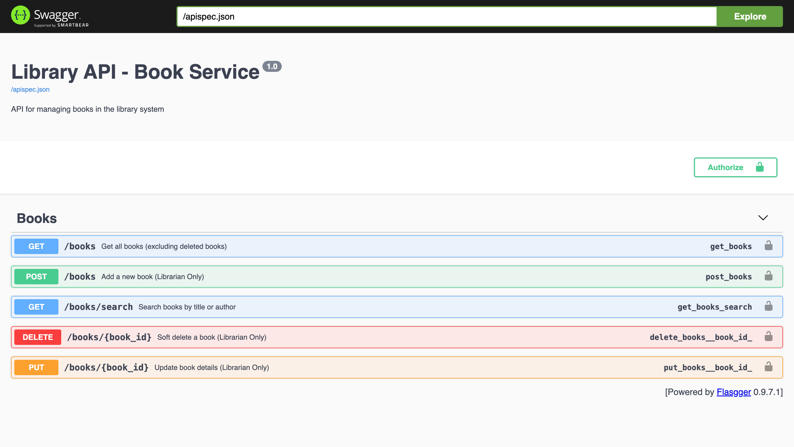
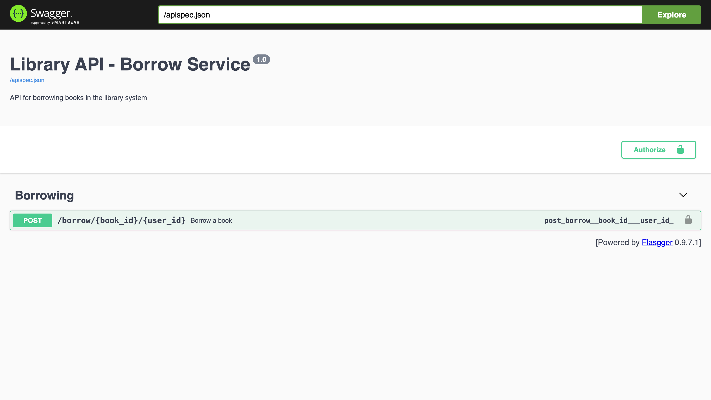

# library-management
service are build on microservices architecture
# run python run_services.py

starting auth_service/auth.py on port 5001...
 * Serving Flask app 'auth'
 * Debug mode: on
WARNING: This is a development server. Do not use it in a production deployment. Use a production WSGI server instead.
 * Running on http://127.0.0.1:5001
Press CTRL+C to quit
 * Restarting with stat
 * Debugger is active!
 * Debugger PIN: 710-987-340
starting book_service/book.py on port 5002...
 * Serving Flask app 'book'
 * Debug mode: on
WARNING: This is a development server. Do not use it in a production deployment. Use a production WSGI server instead.
 * Running on http://127.0.0.1:5002
Press CTRL+C to quit
 * Restarting with stat
 * Debugger is active!
 * Debugger PIN: 710-987-340
starting borrow_service/borrow.py on port 5003...
 * Serving Flask app 'borrow'
 * Debug mode: on
WARNING: This is a development server. Do not use it in a production deployment. Use a production WSGI server instead.
 * Running on http://127.0.0.1:5003
Press CTRL+C to quit
 * Restarting with stat
 * Debugger is active!
 * Debugger PIN: 710-987-340

# API Document
auth login 
http://localhost:5001/apidocs/

book service 
http://localhost:5002/apidocs/

book borrow service
http://localhost:5003/apidocs/

# DB file mysql
library_db.sql

# API SWAGGER

